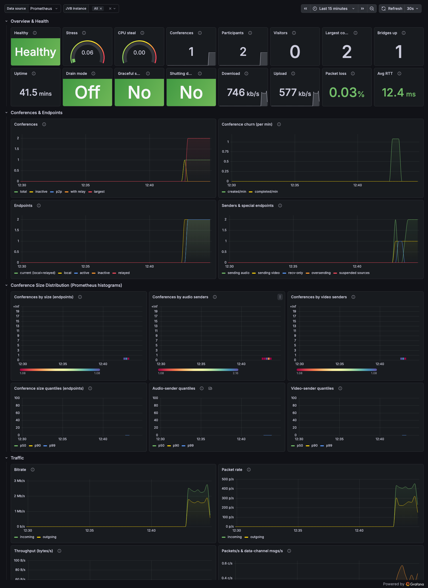

# Jitsi Videobridge — Grafana Dashboard

A modern Grafana dashboard for monitoring **Jitsi Videobridge (JVB)** via its
Prometheus `/metrics` endpoint.

- ✅ Built and tested against **Grafana 13.x**
- ✅ Targets **jitsi-meet `stable-10590`+** (JVB Prometheus exporter, `jitsi_jvb_*` namespace)
- ✅ Includes the **conference-size distribution histograms** (`conferences_by_size`,
  `conferences_by_audio_sender`, `conferences_by_video_sender`) that are **not**
  available from the JSON `/colibri/stats` endpoint
- ✅ Turnkey demo stack (`docker compose up -d`) with Prometheus + Grafana auto-provisioned
- ✅ Multi-bridge ready via an `instance` template variable



Why this exists: the widely-referenced
[systemli/prometheus-jitsi-meet-exporter](https://github.com/systemli/prometheus-jitsi-meet-exporter/tree/main/dashboards)
dashboards predate the native JVB Prometheus endpoint and recent metric changes.
This dashboard is built directly from the metrics a current JVB exposes.

---

## Metrics source

Recent Jitsi Videobridge exposes Prometheus metrics directly — no separate
exporter required. Two endpoints exist:

| Endpoint | Format | Notes |
| --- | --- | --- |
| `/colibri/stats` | JSON | Snapshot gauges only |
| `/metrics` | Prometheus text | **Richer** — counters + histograms. Used by this dashboard. |

The same data is also available as JSON (`/metrics?format=json`) and other
formats, but Prometheus text is what Prometheus scrapes.

> **Conference size distribution** metrics are exposed **only** as Prometheus
> histograms on `/metrics`; the JSON `/colibri/stats` endpoint does not include
> them. This dashboard visualizes them as heatmaps plus p50/p90/p99 quantiles.

### Enabling the endpoint on your JVB

The videobridge serves `/metrics` from its private REST interface (port `8080`
by default). Make sure statistics are enabled and the endpoint is reachable by
Prometheus. In `jvb.conf` (HOCON):

```hocon
videobridge {
  stats {
    enabled = true
  }
  apis {
    rest {
      enabled = true   # exposes /metrics and /colibri/stats on :8080
    }
  }
}
```

In the standard `docker-jitsi-meet` deployment set `JVB_ENABLE_APIS=rest` (or
`colibri,rest`) on the `jvb` container. Do **not** expose port 8080 publicly —
scrape it from inside your network, or via an authenticated reverse proxy.

---

## Quick start (demo stack)

```bash
git clone https://github.com/<you>/jitsi-grafana-dashboard.git
cd jitsi-grafana-dashboard

# Point Prometheus at your JVB:
#   edit prometheus.yml  ->  static_configs.targets: ['your-jvb-host:8080']

docker compose up -d
```

Then open <http://localhost:3000> (login `admin` / `admin`) → **Dashboards →
Jitsi → Jitsi Videobridge**. The Prometheus datasource and the dashboard are
auto-provisioned; no manual import needed.

---

## Import into an existing Grafana

If you already run Grafana + Prometheus, just import the dashboard JSON:

1. **Dashboards → New → Import**
2. Upload [`dashboards/jitsi-jvb.json`](dashboards/jitsi-jvb.json) (or paste its contents)
3. Select your Prometheus datasource when prompted

The dashboard exposes two template variables:

- **Data source** — pick any Prometheus datasource
- **JVB instance** — multi-select; filter to one or more bridges (defaults to *All*)

Requires Grafana **11+** (developed and tested on 13.x).

---

## What's on the dashboard

| Section | Highlights |
| --- | --- |
| **Overview & Health** | health, stress, CPU steal, conferences, participants, visitors, largest conference, bridges up, uptime, drain/shutdown state, up/down bitrate, loss, RTT |
| **Conferences & Endpoints** | conferences by state, create/complete churn, endpoint counts, senders (audio/video/recv-only/oversending) |
| **Conference Size Distribution** | heatmaps + p50/p90/p99 quantiles for size, audio senders, video senders (the histogram-only metrics) |
| **Traffic** | bitrate, packet rate, byte throughput, packets & data-channel messages |
| **Quality & Reliability** | loss fractions, RTT, problem endpoints, ICE/DTLS, connect/reconnect events, media (keyframes/speaker/layering) |
| **Relay (Octo)** | relay bitrate, packet rate, relayed endpoints, relay throughput |
| **JVM & System** | heap, GC, threads/FDs, stress & CPU steal, queue/RTP pipeline errors |
| **XMPP & Signaling** | MUC clients, XMPP disconnects, Colibri WebSocket messages/errors |

49 panels across 8 sections, covering ~all 93 `jitsi_jvb_*` series.

---

## Editing the dashboard

The JSON is generated from a single Python script to keep panel layout and
queries consistent:

```bash
python3 scripts/gen_dashboard.py   # rewrites dashboards/jitsi-jvb.json
```

Edit `scripts/gen_dashboard.py`, regenerate, and the provisioned Grafana picks
up the change within ~10s.

> **Counter note:** JVB exposes Prometheus counters with a `_total` suffix on the
> series name (e.g. `jitsi_jvb_bytes_received_total`) while the `# TYPE` family
> name has no suffix. Rate queries must use the `_total` series. The generator
> handles this automatically.

---

## Compatibility

| Component | Tested |
| --- | --- |
| Grafana | 13.0.x (works on 11+) |
| Prometheus | 2.x / 3.x |
| jitsi-meet | `stable-10590`+ |
| Jitsi Videobridge | 2.3.x (`jitsi_jvb_*` metrics namespace) |

## License

[MIT](LICENSE)
